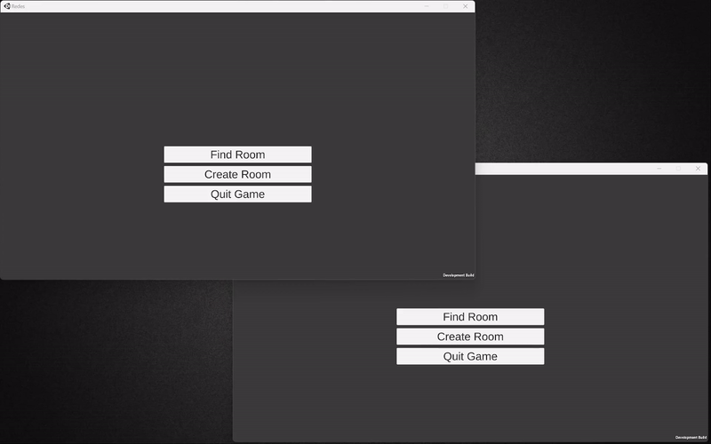

# Unity Multiplayer Lobby System

This project demonstrates a peer-to-peer multiplayer lobby system developed in Unity using Photon Networking technology. It provides an intuitive and efficient solution for creating and managing multiplayer game sessions.

---

## Features

- **Peer-to-Peer Networking**: Utilizes Photon for robust multiplayer connectivity.
- **Lobby Management**: Allows users to easily create, host, and join game sessions.
- **Error Handling**: Ensures a reliable and smooth experience by gracefully handling connection issues.
- **Swap Host**: Automatically swap host as soon as the current one leaves the lobby.

---

## How It Works

1. **Lobby Creation**: Users can create a new lobby and customize game settings.
2. **Joining a Lobby**: Players can browse available lobbies and join one.
3. **Error Handling**: The system detects and recovers from connection issues to maintain a smooth experience.

---

## Technologies Used

- **Unity**: Game engine for development.
- **C#**: Programming language.
- **Photon Networking**: Backend for multiplayer functionality.

---

- **Gustavo Barros**
